# Short-descriptor translation table format
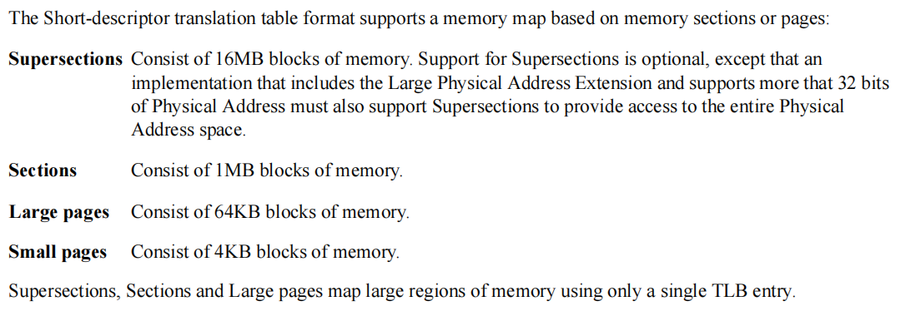
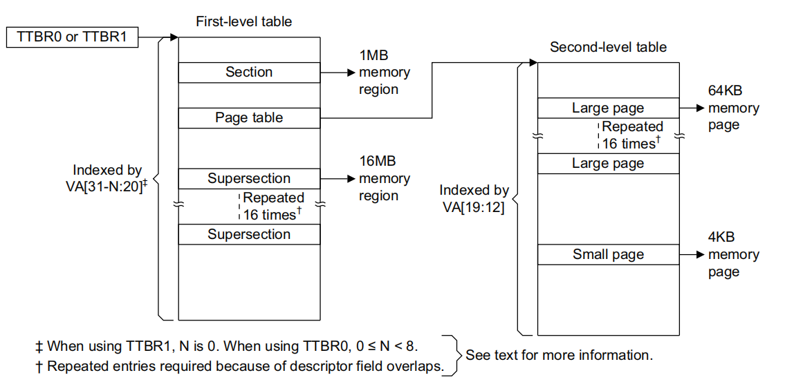

## first-level descriptor formats
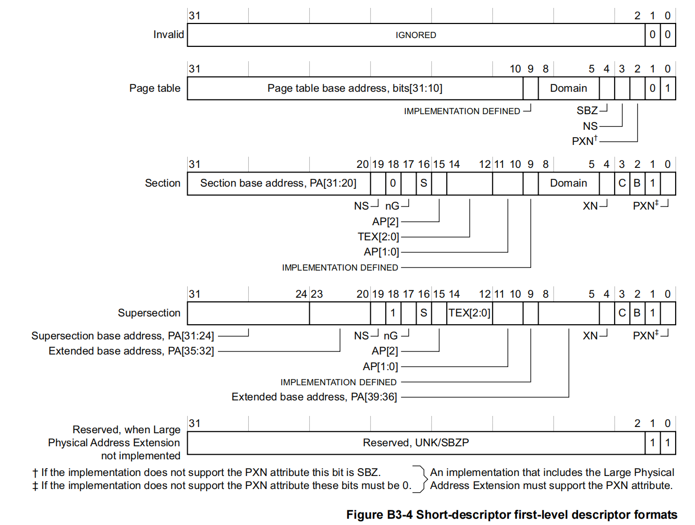
## second-level descriptor formats
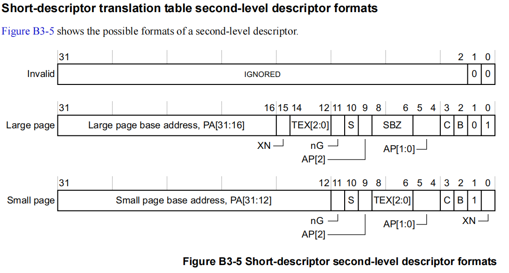

## Memory attributes in the Short-descriptor translation table format descriptors
### TEX[2:0], C, B
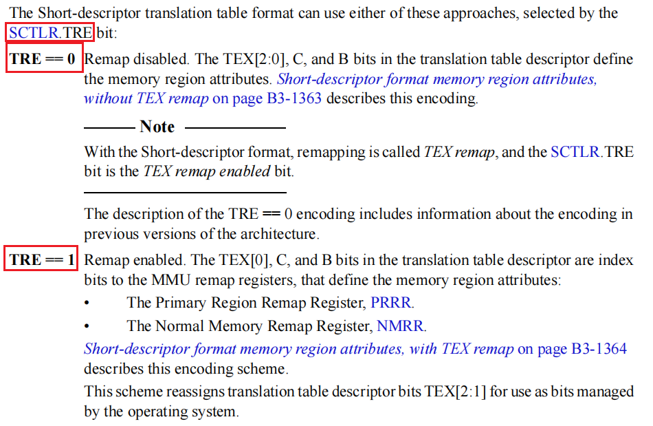
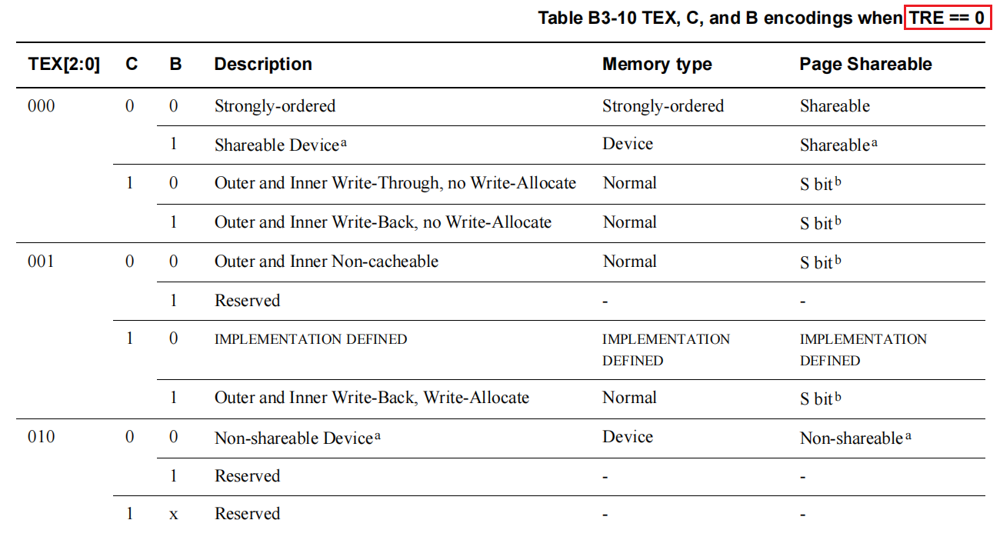
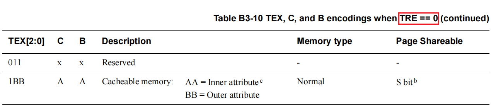
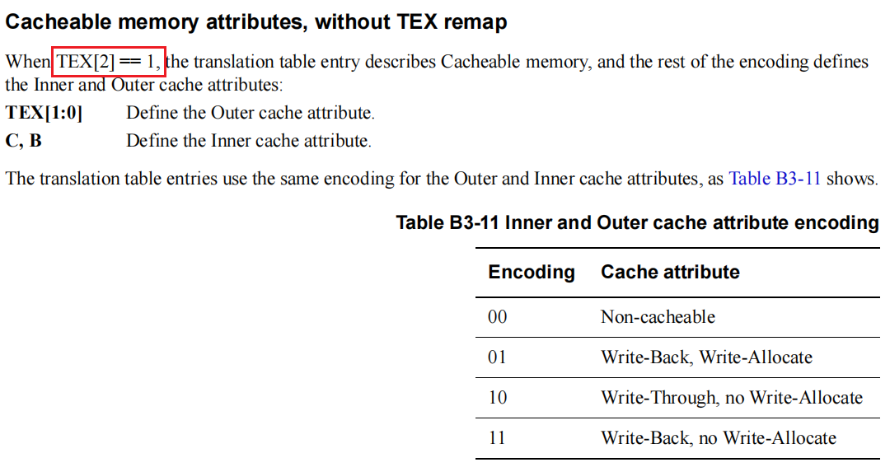
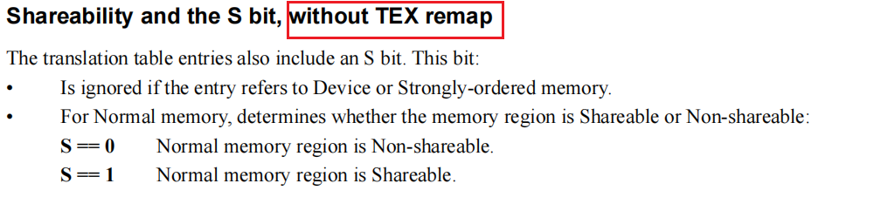
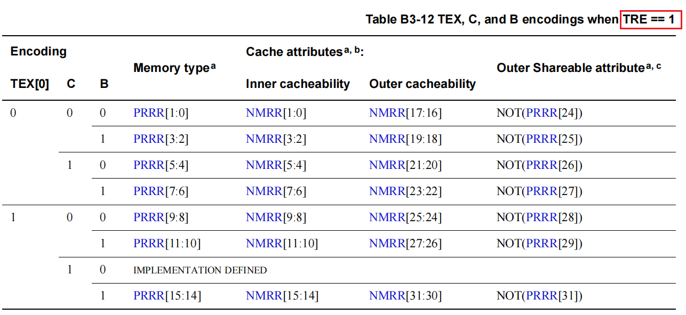
### XN, PXN
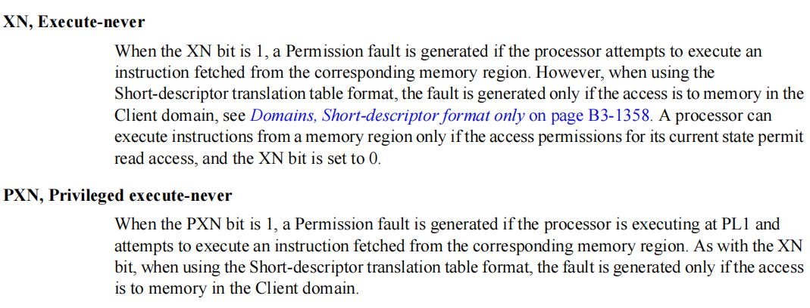
### NS
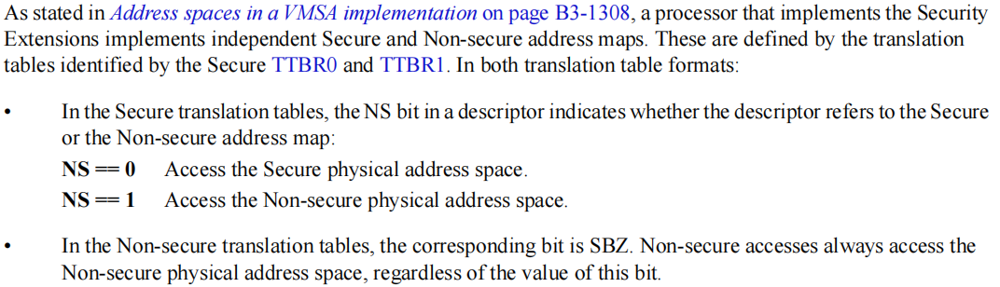
### nG
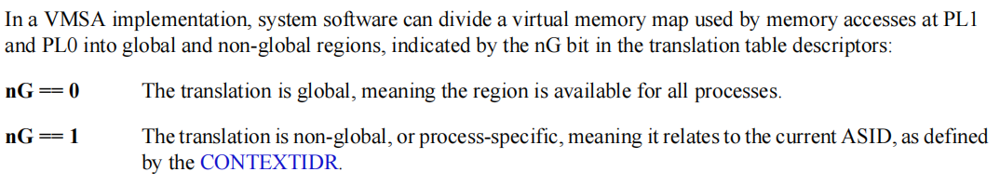
### AP
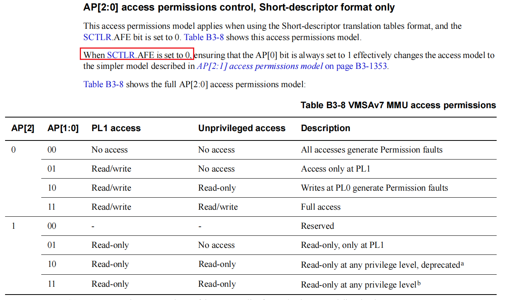